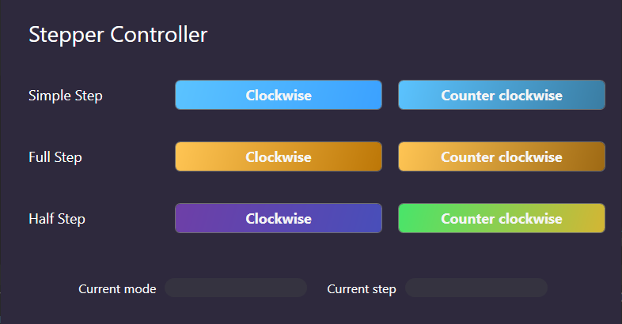

# Stepper Controller

This is a simple desktop app for a stepper motor controller. It is made using WPF.

To build this, you need to have the dotNet Core installed; 6.0 in my case.

Use this command to build an executable on the parent folder of this solution.

```powershell
dotnet publish .\StepperController\StepperController.csproj -o '..\Stepper Controller'
```

## App user interface


